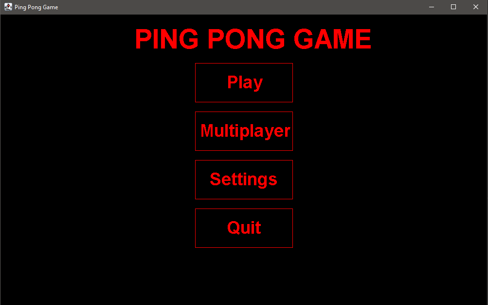
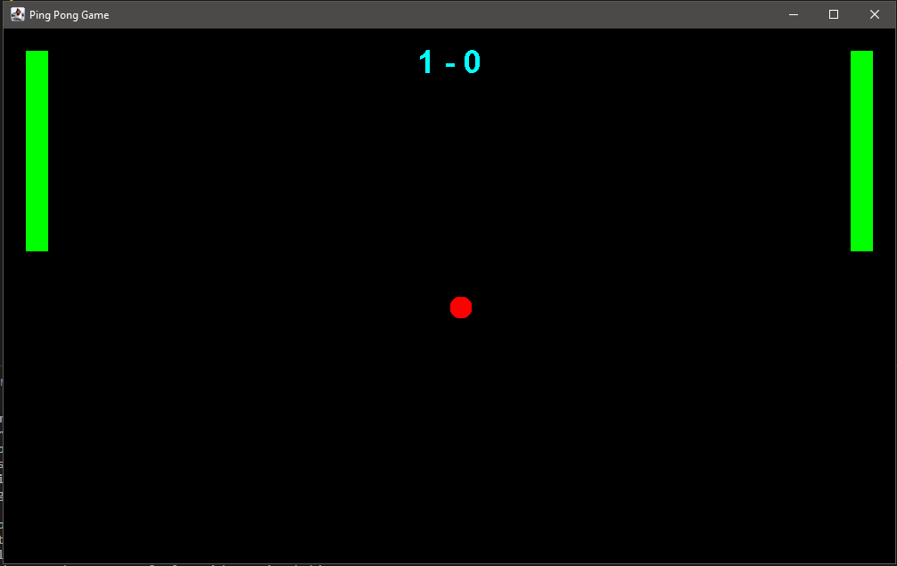

# PingPong Peli
Java Swing Ping Pong - AI-vastustajalla
Yksinkertainen Pong-peli toteutettu Javalla. 
Ominaisuudet:

Klassinen ping pong -pelimekaniikka
Ohjaus: nuolinäppäimet ja hiiri
AI-vastustaja
Asetukset
Pisteenlasku

Teknologia: Java (Swing/AWT)

# Päävalikko

# Peli

